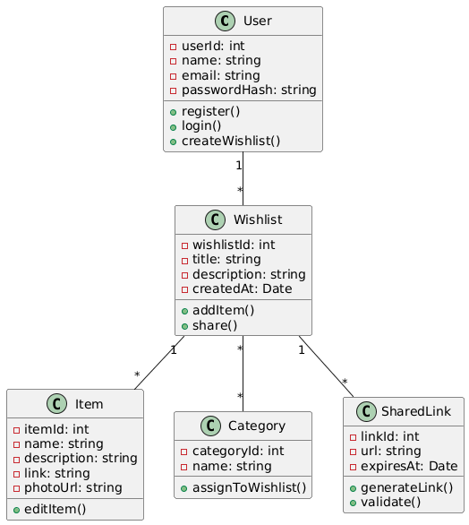
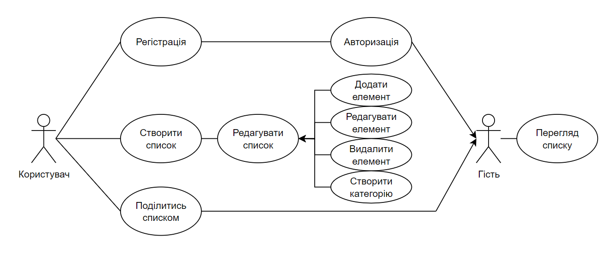

### LAB2 

___

 - ## Class UML - діаграмма
 - Ми обрали UML-діаграми, оскільки вони є стандартним інструментом моделювання програмних систем. Вони дозволяють візуально представити архітектуру додатку, структуру класів та взаємодію між ними. Використання UML робить опис системи зрозумілим для розробників і замовників, а також спрощує подальшу розробку і тестування.
 - 

___

 - ## Use Case UML - діаграмма
 - Ми обрали Use Case діаграму, оскільки вона найкраще підходить для відображення функціональних вимог системи. Вона дозволяє чітко показати взаємодію між користувачами (акторами) та системою, визначити основні сценарії використання додатку та зробити вимоги зрозумілими як для розробників, так і для замовників.
 - 

___
